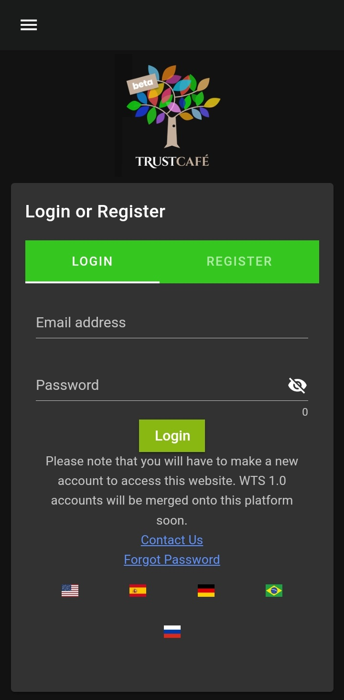
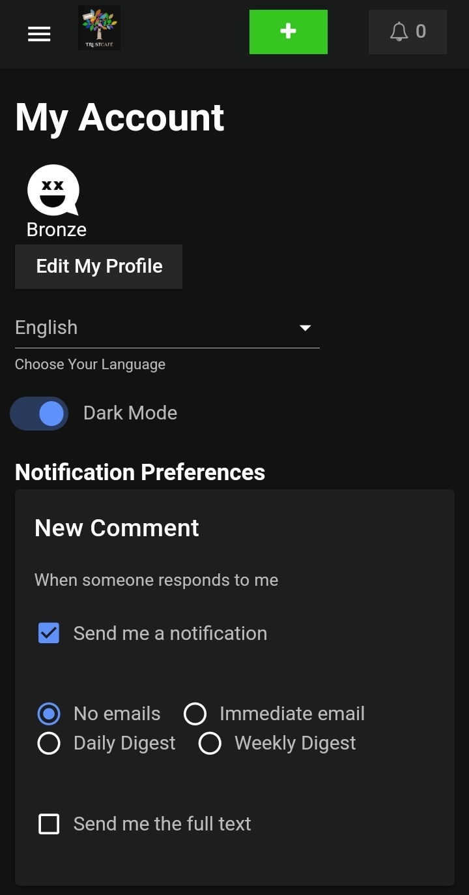

# Wikit

App for WikiTribune Social 2.0, a community-led and community-moderated platform dedicated to creating a space where discussions can thrive.

## Download

## Debug

`yarn install`

`npx expo start`

`eas build --profile development --platform android`

## Screenshots

    
    
    
    

## Local build

`sudo ./sdkmanager --install "cmake;3.22.1"`

`export ANDROID_HOME="/usr/lib/android-sdk"`

`eas build --platform android --local`

`eas build --profile development --platform android --local`

## Prod Build

`eas build -p android`

`eas build --profile production --platform android`
